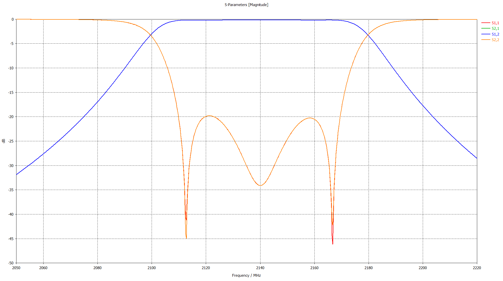
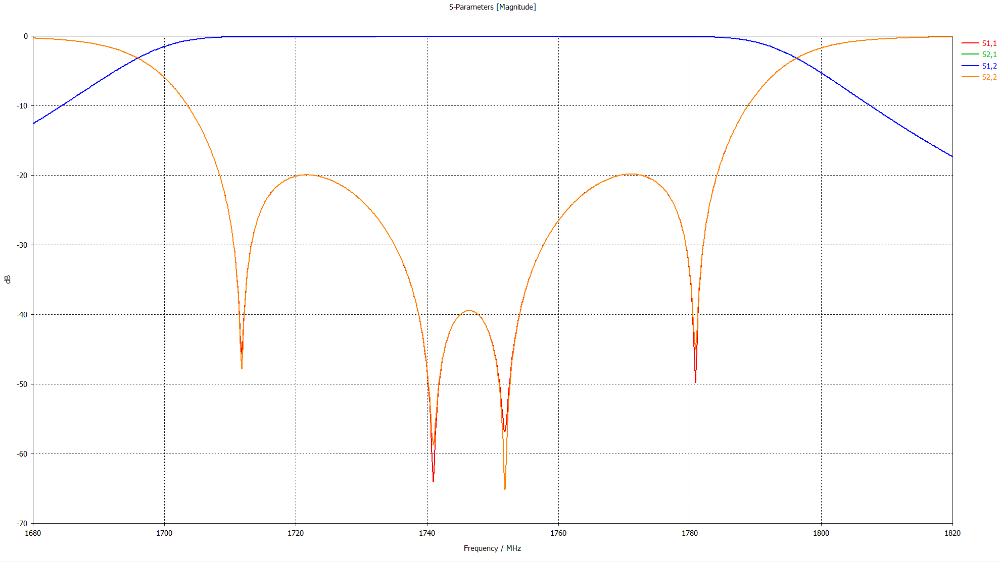
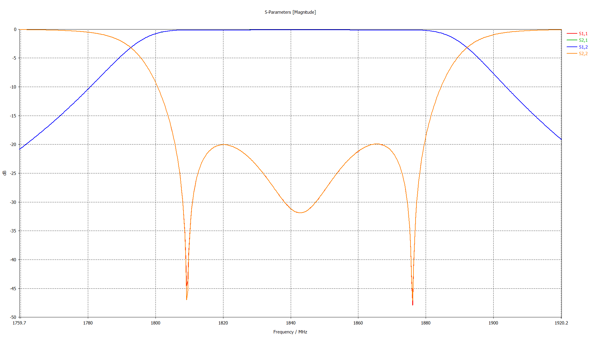

Реализованные фильтры на объёмных резонаторах:

band 1 Uplink: [`File`](filter_b1_Rx.cst)

band 1 Downlink: [`File`](b1_Tx.cst)

band 3 Uplink: [`File`](b3_Rx.cst)

band 3 Downlink: [`File`](b3_Tx.cst)

